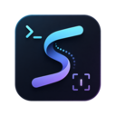

<p align="center">
  
</p>

<h1 align="center">sivtr</h1>

<p align="center">
  Terminal output workspace for the AI era.
  <br>
  Capture, sift, browse, search, select, and reuse terminal output and Codex sessions.
</p>

<p align="center">
  <a href="https://crates.io/crates/sivtr"></a>
  <a href="https://marketplace.visualstudio.com/items?itemName=ariestar.sivtr-vscode"></a>
  <a href="https://github.com/Ariestar/sivtr/actions/workflows/rust.yml"></a>
  <a href="LICENSE"></a>
  <a href="rust-toolchain.toml"></a>
</p>

<p align="center">
  <strong>English</strong>
  ·
  <a href="README.zh-CN.md">简体中文</a>
  ·
  <a href="https://sivtr.pages.dev/">Docs</a>
  ·
  <a href="https://sivtr.pages.dev/zh-cn/">中文文档</a>
</p>

---

## What is sivtr?

`sivtr` turns noisy terminal streams into reusable text assets. It is built for developers who move between shells, build logs, test failures, AI-agent replies, tool output, and long Codex sessions.

It is not a terminal emulator and not a multiplexer. It is a companion tool for the terminal workflows you already use.

## Highlights

- Browse command output in a fast keyboard-first TUI.
- Pipe any command into a searchable, selectable output viewer.
- Record shell command blocks and copy recent inputs, outputs, or bare commands.
- Read Codex session JSONL files and copy useful user, assistant, or tool blocks.
- Open an AI session picker from VS Code with one shortcut.
- Filter copied text with regex and line ranges.
- Keep a local SQLite history for later search.
- Compare recent command outputs while iterating on tests and builds.

## Install

Install the CLI from crates.io:

```bash
cargo install sivtr
```

Install from source:

```bash
git clone https://github.com/Ariestar/sivtr.git
cd sivtr
cargo install --path .
```

Install the VS Code bridge from the Marketplace:

```text
ariestar.sivtr-vscode
```

The extension launches the AI session picker from the current workspace. If the `sivtr` CLI is missing, it offers to run `cargo install sivtr` in a visible terminal.

## Quick Start

Browse command output:

```bash
cargo test 2>&1 | sivtr
```

Run a command through `sivtr` and inspect the captured output:

```bash
sivtr run cargo build
```

Copy the latest command block from the current shell session:

```bash
sivtr copy
```

Copy the latest assistant reply from the current Codex project session:

```bash
sivtr copy codex out
```

Open an interactive picker for Codex conversation blocks:

```bash
sivtr copy codex --pick
```

Compare two recent command outputs:

```bash
sivtr diff 1 2
```

## Core Workflows

### Browse Output

Use pipe mode when you already have a command:

```bash
some-command --verbose 2>&1 | sivtr
```

Use run mode when you want `sivtr` to execute, capture, and then open output:

```bash
sivtr run cargo test
```

Inside the TUI, move with Vim-style keys, search with `/`, enter visual selection with `v`, and copy with `y`.

### Copy Command Blocks

With shell integration enabled, `sivtr` records command blocks so you can copy recent inputs and outputs later:

```bash
sivtr copy              # latest input + output
sivtr copy out          # latest output only
sivtr copy in 2..4      # user input from recent blocks
sivtr copy cmd --pick   # pick and copy bare commands
```

Selectors are newest-first: `1` is the latest block, `2` is the one before it, and `2..4` selects multiple blocks.

Filters run after text is assembled:

```bash
sivtr copy out --regex panic
sivtr copy out --lines 10:40
```

### Reuse Codex Sessions

`sivtr copy codex` reads Codex rollout JSONL files from `~/.codex/sessions`. When an active Codex shell exports `CODEX_THREAD_ID`, `sivtr` prefers that exact local session first. Otherwise it chooses the newest local session whose `cwd` matches your current directory.

For shared read-only access to another account's Codex sessions, mirror them into a separate directory and add that directory to `[codex].session_dirs` instead of running `sivtr` with elevated privileges. Shared/mirrored trees only participate in explicit browsing through `--pick`.

Use `--session N` to open the Nth newest selectable session (the same numbering shown in `--pick`), or `--session ID` to match a session id / id prefix explicitly.

```bash
sivtr copy codex        # latest completed user + assistant turn
sivtr copy codex out    # latest assistant reply
sivtr copy codex in     # latest user message
sivtr copy codex tool   # latest tool output
sivtr copy codex all    # parsed session
```

Progress commentary is filtered by default, so `sivtr copy codex out` returns the final assistant reply instead of intermediate status updates.

### VS Code Shortcut

The VS Code extension contributes:

```text
Sivtr: Pick AI Session
```

Default keybinding:

```text
Alt+Y
```

You can rebind it to `Ctrl+Y`, but that usually overrides the editor Redo shortcut.

### Windows Global Hotkey

On Windows, the hotkey daemon can open the AI session picker from anywhere:

```bash
sivtr hotkey start
sivtr hotkey status
sivtr hotkey stop
```

The default shortcut is `alt+y`.

## Command Reference

| Command | Purpose |
| --- | --- |
| `sivtr` / `sivtr pipe` | Read output from stdin and open the TUI browser. |
| `sivtr run <command>` | Execute a command, capture output, then browse it. |
| `sivtr copy` | Copy recent command blocks. |
| `sivtr copy codex` | Copy useful content from the current Codex session. |
| `sivtr diff <left> <right>` | Compare recent command blocks. |
| `sivtr history` | List, search, and show captured output history. |
| `sivtr config` | Manage the TOML config file. |
| `sivtr init <shell>` | Generate shell integration for command-block capture. |
| `sivtr import` | Open the current session log. |
| `sivtr hotkey` | Manage the Windows AI session picker hotkey. |
| `sivtr clear` | Clear session logs. |

## TUI Keys

| Key | Mode | Action |
| --- | --- | --- |
| `j` / `Down` | Normal | Move down |
| `k` / `Up` | Normal | Move up |
| `h` / `Left` | Normal | Move left |
| `l` / `Right` | Normal | Move right |
| `Ctrl-D` | Normal | Half page down |
| `Ctrl-U` | Normal | Half page up |
| `g` | Normal | Go to top |
| `G` | Normal | Go to bottom |
| `/` | Normal | Start search |
| `n` / `N` | Normal | Next / previous match |
| `v` / `V` / `Ctrl-V` | Normal | Visual, visual line, visual block |
| `y` | Visual | Copy selection to clipboard |
| `Esc` | Visual/Search/Insert | Cancel |
| `q` | Normal | Quit |

## Documentation

- English docs: [https://sivtr.pages.dev/](https://sivtr.pages.dev/)
- Chinese docs: [https://sivtr.pages.dev/zh-cn/](https://sivtr.pages.dev/zh-cn/)
- VS Code extension: [editors/vscode/README.md](editors/vscode/README.md)

## Development

```bash
cargo fmt --all -- --check
cargo clippy --workspace --all-targets -- -D warnings
cargo test --workspace
```

VS Code extension:

```bash
cd editors/vscode
pnpm install
pnpm run compile
pnpm run package
```

Workspace layout:

```text
sivtr/
|- crates/sivtr-core/    # Capture, parsing, buffers, selection, search, history, export
|- src/                  # CLI, TUI, commands, hotkey integration
|- docs-site/            # Astro/Starlight documentation site
|- editors/vscode/       # VS Code extension bridge for the AI session picker
`- .github/workflows/    # CI and release automation
```

## License

sivtr is licensed under the [Apache License 2.0](LICENSE).
