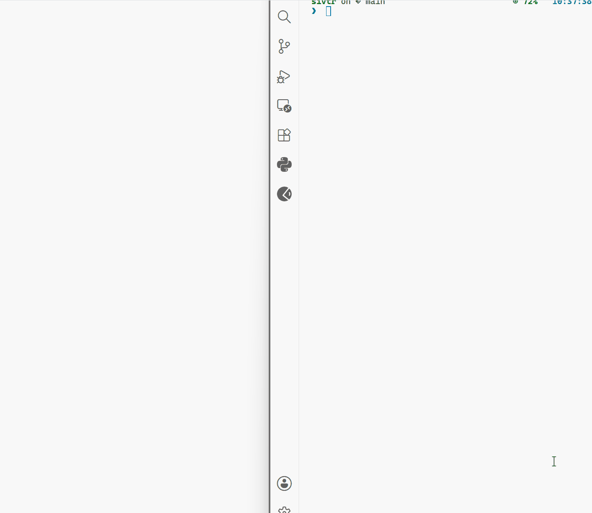
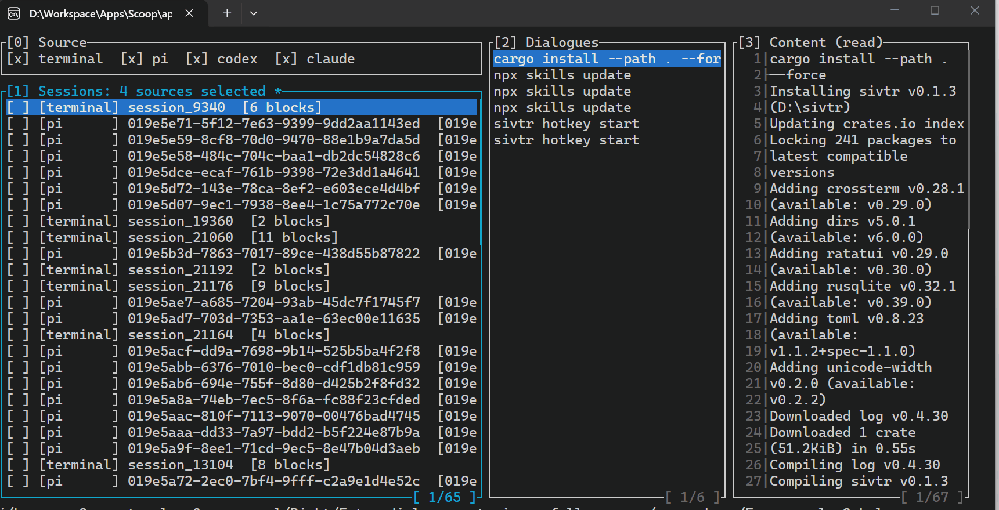
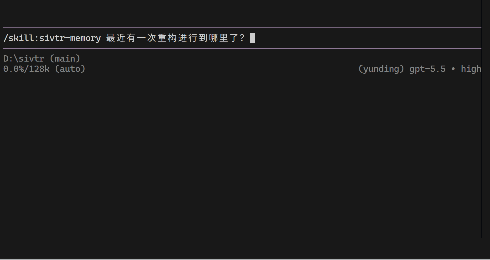
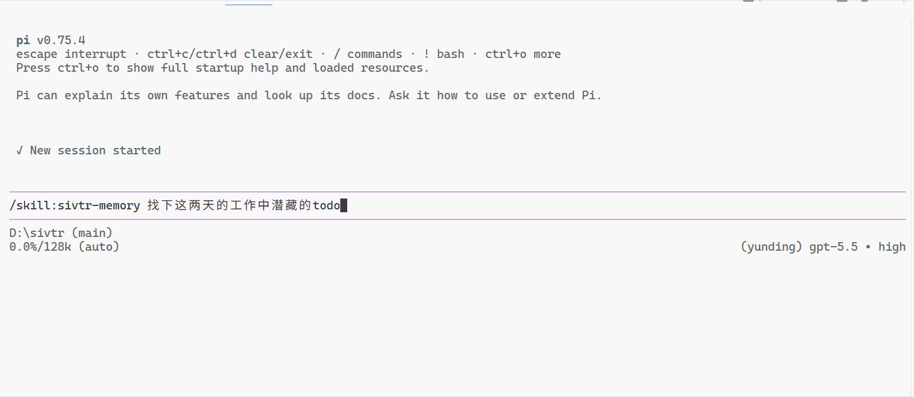

<p align="center">
  
</p>

<h1 align="center">sivtr</h1>

<p align="center">
  一个面向智能体和人的统一的记忆空间
  <br>
  让智能体和终端共享同一个上下文
  <br>
  <strong>你的 Agent 记忆，不必是一套笨重的知识系统。</strong>
</p>

<p align="center">
  <a href="https://crates.io/crates/sivtr"></a>
  <a href="https://marketplace.visualstudio.com/items?itemName=ariestar.sivtr-vscode"></a>
  <a href="https://github.com/Ariestar/sivtr/actions/workflows/rust.yml"></a>
  <a href="https://deepwiki.com/Ariestar/sivtr"></a>
  <a href="Cargo.toml"></a>
  <a href="https://linux.do/"></a>
</p>

<p align="center">
  <strong>简体中文</strong>
  ·
  <a href="README.en.md">English</a>
  ·
  <a href="https://sivtr.pages.dev/">Docs</a>
  ·
  <a href="https://sivtr.pages.dev/zh-cn/">中文文档</a>
</p>

<p align="center">
  
</p>

---

## 为什么需要 sivtr？

开发者和 Agent 经常浪费时间重建已经存在的上下文：终端报错、测试输出、工具日志、之前的 AI 会话。`sivtr` 把这些本地工作变成可搜索的记忆，但不要求你引入一套很重的知识系统。

有了 `sivtr`，你可以：

- 让 Agent 修复最近一次失败，而不用自己粘贴日志；
- 几秒钟找回昨天的测试输出、构建报错或关键决策；
- 从摘要跳回当时那条命令输出或 Agent 回复；
- 把一组有用结果保存成 `@failures` 这样的变量，在下一条命令里继续用。

> [!IMPORTANT]
> Agent 工作流建议安装 `sivtr` CLI，用 `sivtr mcp install` 注册 MCP，并可选用内置 `sivtr-memory` skill。MCP 是 Agent 读取本地证据的主路径；skill 负责教它何时、如何调用。

## 特性

- **MCP 优先的 Agent 记忆**：一次 `sivtr mcp install`，Agent 直接调用 search/show/zoom/filter/status/usage/stats 工具，不用你粘贴日志。
- **保留输出的终端捕获**：记录 Bash、Zsh、PowerShell、Nushell 里的命令、stdout/stderr、退出码、目录和耗时；`pipe` 和 `run` 直接写入同一个 archive。
- **统一本地 archive**：所有终端和 Agent session 先同步到一个 `archive.db`；provider 只负责发现和解析，搜索、筛选、导出、TUI、MCP、Web API 共用同一份记录模型。
- **40+ Agent provider**：Codex / Claude Code / Cursor / Dsh / Gemini / Goose / Hermes / OpenCode / OpenClaw / Grok / Pi / Qoder / Qoder-CN / Qwen，以及更多 JSONL、SQLite、目录和容器格式——同一个 registry 和查询面。
- **精确证据，而不是摘要**：每个命中都落到稳定 ref，可 show / zoom / filter，或交给下一个 Agent。
- **命名记忆变量**：把结果保存成 `@failures`，复用 `@last`，管道用 `@`，也可 `@failures[1,3..5]` 取子集。
- **用量与成本**：从 transcript 提取 token usage，用精确微美元整数和内置 pricing snapshot 计算成本；未知价格明确显示为 unpriced，不猜价格。
- **可选 semantic / hybrid search**：配置一个 OpenAI-compatible embedding endpoint 后，用向量排序或 RRF 融合 BM25；不配置时结构化搜索仍完整可用。
- **统计、质量和可移植导入导出**：`stats`、secret findings、starred sessions、Claude.ai/ChatGPT JSON/ZIP 导入，以及 JSON/JSONL/Markdown/HTML 导出。
- **跨设备访问**：只读分享 workspace，用 `desk:...` ref 像读本地一样浏览另一台设备；多设备还能组成 `group`，成员间自动同步、一次 `sync` 拉齐。
- **主题可配**：`[theme] mode = auto|dark|light`，自动跟随系统外观并检测 truecolor。
- **一键安装与诊断**：`sivtr setup` 装 hooks + MCP；`sivtr doctor --fix` 自动修复。
- **人用 CLI 仍然在**：search / show / filter / nav，以及 TUI 浏览器——有用，但不是主叙事。

## 快速开始

安装预编译 CLI（无需 Rust 工具链）：

```bash
cargo binstall sivtr
```

Linux 上 `cargo binstall` 默认安装静态 musl 构建（不依赖系统 GLIBC 版本），与 `install.sh` 同源。

其它方式：

```bash
cargo install sivtr                  # 从源码编译（需要 Rust）
curl -fsSL https://raw.githubusercontent.com/Ariestar/sivtr/main/install.sh | sh   # Linux/macOS/WSL 一行安装
```

Windows（PowerShell）：

```powershell
irm https://raw.githubusercontent.com/Ariestar/sivtr/main/install.ps1 | iex
```

升级：

```bash
sivtr update    # 下载最新 release，SHA256 校验后原地替换
```

首次安装（采集 + MCP 宿主）：

```bash
sivtr setup                  # 采集 + MCP 宿主 + sivtr-memory skill（缺失时安装）
# 或分步：
sivtr init all              # 或单个 shell：bash、zsh、nushell、powershell
sivtr mcp install            # 检测已装宿主；或 -p claude,cursor,codex,opencode,openclaw,grok,hermes,pi,qoder,qodercn,gemini,qwen,goose
npx skills add Ariestar/sivtr --skill sivtr-memory -g -y
sivtr doctor
```

> [!NOTE]
> `sivtr setup` 或 `sivtr init` 安装 shell 集成后，**新开一个 shell** 即可捕获命令输出，无需额外启用。升级后重新运行 `init` 会原位更新旧 hook。要暂停捕获，用 `sivtr config edit` 设置 `[pty_proxy] enabled = false` 并重启 shell；安装和升级都会保留这个显式关闭设置。

同步并查看 archive：

```bash
sivtr sync
sivtr usage daily
sivtr stats
```

> [!NOTE]
> 在 Windows 上，如果 `sivtr init powershell` 提示 profile 没有加载，执行一次 `Set-ExecutionPolicy -Scope CurrentUser RemoteSigned` 把当前用户的执行策略调高即可。sivtr 不会修改注册表——hook 只写在你的 PowerShell profile 里。

## Agent 记忆（MCP）

这是主路径。`sivtr mcp install` 之后，Agent 通过结构化工具读写本地终端与 AI session 记忆：

| 工具 | 用途 |
| --- | --- |
| `sivtr_search` | 找最近失败、决策、命令 |
| `sivtr_show` | 打开命中背后的精确 record/part |
| `sivtr_zoom` | 展开前后上下文 |
| `sivtr_filter` | 缩小结果集 |
| `sivtr_status` | workspace / remote / origin 状态 |
| `sivtr_usage` | token 用量与模型成本 |
| `sivtr_stats` | archive 活动、质量与用量统计 |

可选 skill（教 Agent 何时调用这些工具）：

```bash
npx skills add Ariestar/sivtr --skill sivtr-memory -g
```

然后直接说：

```text
修复最近的终端报错。先用 sivtr。
```

Agent 应先搜本地证据、打开原文、改代码并验证——而不是让你粘贴日志。

需要自己查时，CLI 仍然可用：

```bash
sivtr s terminal --status failure --latest 5 --refs
sivtr s agent -m "TODO|decision|failed" --since today -f timeline
```

## 示例

更多完整玩法见 [Playbooks / 玩法实例](https://sivtr.pages.dev/zh-cn/playbooks/)。

| 场景 | 你怎么用 | 演示 |
| --- | --- | --- |
| 修复最近的终端报错 | 对 Agent 说（MCP）：<br><code>修复最近的终端报错。先用 sivtr。</code> |  |
| 中断后继续 | 对 Agent 说：<br><code>继续。先用 sivtr memory。</code> |  |
| 给下一个 Agent 写交接 | 对 Agent 说：<br><code>给下一个 Agent 写一份带证据的交接。</code> |  |
| 生成最近工作时间线 | <code>sivtr s agent --since today --sort oldest -f timeline</code><br><code>sivtr s terminal --since today --sort oldest -f timeline</code> |  |
| 把结果保存成变量并继续处理 | <code>sivtr s terminal -m "panic" --save failures</code><br><code>sivtr filter @failures --status failure --refs</code> |  |

## 核心概念

| 概念 | 含义 |
| --- | --- |
| WorkRecord | 一个有用的工作事件：终端命令、Agent turn、工具调用或捕获输出块。 |
| WorkPart | Record 里的命令、输出、assistant 回复、tool output 或 error。只想拿有用片段而不是整个事件时用它。 |
| WorkRef | 某段精确记忆的稳定地址，例如 `pi/<session>/3/p1`。适合引用、复现和交接。 |
| WorkSet | `@last`、`@failures` 这类记忆变量背后的数据：一组有顺序的 refs，可以筛选、保存、切片、管道传递、导航、扩展和展示。 |

记忆变量：

| 句柄 | 用途 |
| --- | --- |
| `@last` | 最近一次搜索或投影结果。 |
| `@name` | 通过 `--save name` 或 `sivtr var set name` 创建的命名变量，例如 `@failures`。 |
| `@name[1,3..5]` | 从已保存变量中只取几项。 |
| `@` | 使用管道里上一条命令传来的结果。 |

## 命令速查

完整命令、子命令与参数见 [CLI Reference](https://sivtr.pages.dev/zh-cn/reference/cli/)。核心命令速查：

**安装与维护**

```bash
sivtr setup                              # 一键配置：环境检测 + hooks + MCP + skill + smoke
sivtr doctor --fix                       # 诊断并自动修复 binary/config/hooks/providers
sivtr mcp install -p claude,cursor,codex # 指定宿主注册 MCP（不指定则检测已装的）
sivtr update                             # 自更新到最新 release
sivtr config show                        # 查看配置（init 生成默认文件 / edit 用 $EDITOR 打开）
```

**日常使用**

```bash
sivtr                                    # TUI workspace 浏览器
sivtr run cargo test                     # 执行命令并捕获输出（run <COMMAND> [ARGS...]）
sivtr s terminal --status failure --latest 5 --refs   # 最近 5 个失败终端事件
sivtr s agent -m "panic|TODO" --since today -f timeline # 今天的 agent 决策时间线
sivtr show @last                         # 打开上次搜索结果内容
sivtr show desk:terminal/session_42/3    # 打开远端精确 ref
sivtr copy                               # 复制最近命令块
sivtr copy out 2..4                      # 第 2~4 块的输出
sivtr copy in --pick --regex panic       # 交互挑选含 panic 的输入块
sivtr copy cmd --pick                    # 交互挑选命令本身
sivtr copy 3 --print                     # 第 3 块直接打印到 stdout
sivtr usage daily --breakdown             # 按天/provider/model 查看 token 与成本
sivtr usage session codex/<session-id>    # 查看单个 session 的用量
sivtr export sessions --format markdown   # 导出 archive 中的 session
sivtr import sessions --provider chatgpt conversations.json
```

**远程与协同**

```bash
sivtr share                              # 交互选择 workspace 创建只读分享
sivtr share invite <share> --expires 10m # 签发单次 invite（stdout = bare key）
sivtr remote add desk <invite-key>       # 把队友的 share 挂成本机 remote `desk`
sivtr group create <name>                  # 建组并贡献当前 workspace（如 create team）
sivtr group invite <name> --expires 1d --max-uses 10   # 签发多设备 join 链接
sivtr group join <invite-key>            # 加入并贡献自己的 workspace
sivtr group members team                 # 组内成员与其贡献
sivtr s <peer>:terminal --status failure --latest 5 --refs  # 读队友记忆像读本地
```

## 远程访问

两台装了 sivtr 的设备可以像读本地一样互相读取 workspace 的 session——用于协同开发：想看队友的终端输出或 AI 会话时，不用离开自己的机器。

ref 统一为 `origin:body`：

```text
codex/4                 # 本机当前 workspace
docs:codex/4            # 本机另一个 workspace（按目录名）
desk:terminal/...       # remote add 得到的远端名
alice/sivtr:hermes/...  # device/workspace 坐标
```

在持有 workspace 的设备上：

```bash
sivtr share                   # 交互选择 workspace（Enter = 当前）；只创建 share
sivtr share invite <name>     # 签发单次 invite（stdout = bare key）
sivtr ws list                 # 查看本机 workspace origin 标签
```

在另一台设备上：

```bash
sivtr remote add desk <invite>   # 粘贴 `sivtr share invite` 输出的 bare key
sivtr s desk:terminal --status failure --latest 5 --refs
sivtr show desk:terminal/session_42/3
sivtr zoom desk:terminal/session_42/3 -C 2
sivtr nav desk:terminal/session_42/3 +1 --refs
sivtr copy desk:terminal/session_42/3 --print
```

分享是 opt-in、只读，默认在数据离开本机前脱敏常见密钥。远程传输走加密 iroh；需要时会自动启动 daemon。未登记的 origin 会报错——用 `sivtr remote add` 登记 remote，或用 `sivtr ws` 查看本机 workspace。

## 群组（group）

两台以上设备要长期共享记忆时，与其各自 `share` 再挂载，不如组成一个群组：组内每台设备贡献自己的 workspace，成员之间自动同步、随时互相读取。

```bash
# 组主（owner）在 A 机上：
sivtr group create <name>      # 建组并贡献当前 workspace
sivtr group invite <name>      # 签发多设备 join 链接（stdout = bare key）

# 成员在 B 机上：
sivtr group join <invite>      # 加入并贡献自己的 workspace
sivtr group list               # 所有组
sivtr group members <name>     # 组内成员与其贡献
sivtr group sync <name>        # 手动拉一次成员清单

# 日常使用：像本地一样读队友的记忆
sivtr s <peer>:terminal --status failure --latest 5 --refs
```

组由 owner 管理：`rename` 改名、`remove <group> <peer>` 踢人；owner 退出（`leave`）会解散整组。成员每次变更都自动同步给全组，无需手动刷新。

## 支持来源

| Source | 支持内容 |
| --- | --- |
| Terminal | Bash、Zsh、PowerShell、Nushell shell hooks；pipe 和 run capture。 |
| Codex | 本地 rollout/session JSONL files。 |
| Claude Code | 本地 transcript/session files。 |
| Cursor | 本地 Cursor agent transcript JSONL。 |
| OpenCode | 本地 session 数据库。 |
| OpenClaw | 本地 OpenClaw agent SQLite（+ legacy JSONL）。 |
| Hermes | 本地 Hermes `state.db`（`sessions/` 下 JSONL 为 residual）。 |
| Grok | 本地 Grok agent sessions（`~/.grok`，可用 `GROK_HOME`）。 |
| Dsh | 本地 Dsh agent sessions。 |
| Gemini | 本地 Gemini CLI sessions。 |
| Goose | 本地 Goose agent sessions。 |
| Pi | 本地 Pi agent session logs。 |
| Qoder / Qoder-CN | 本地 Qoder 与 Qoder-CN agent sessions。 |
| Qwen | 本地 Qwen Code sessions。 |
| 更多 provider | Amp、Aider、Antigravity、Copilot、Forge、gptme、iFlow、Kimi、Kiro、OpenHands、Poolside、RooCode、Trae、Vibe、VSCode Copilot、Windsurf、Zed、Zencoder 等。 |
| Web 导入 | Claude.ai 与 ChatGPT 的 JSON/ZIP 导出，经 `sivtr import sessions` 写入 archive。 |

## 文档

- 文档：[https://sivtr.pages.dev/](https://sivtr.pages.dev/)
- 中文文档：[https://sivtr.pages.dev/zh-cn/](https://sivtr.pages.dev/zh-cn/)
- Playbooks：[https://sivtr.pages.dev/zh-cn/playbooks/](https://sivtr.pages.dev/zh-cn/playbooks/)
- CLI Reference：[docs-site/src/content/docs/reference/cli.md](docs-site/src/content/docs/reference/cli.md)
- Memory skill：[skills/sivtr-memory](skills/sivtr-memory)

## 开发

环境、PR 约定与编码指南见 [CONTRIBUTING.md](CONTRIBUTING.md)。

```bash
cargo fmt --all -- --check
cargo clippy --workspace --all-targets -- -D warnings
cargo test --workspace
```

文档站：

```bash
cd docs-site
bun install --frozen-lockfile
bun run build
```

仓库结构：

```text
crates/sivtr-core/  core model、provider parsers、archive、usage、search、config
src/                CLI commands、TUI、shell hooks、hotkey integration
docs-site/          Astro/Starlight documentation site
editors/vscode/     AI session picker 的 VS Code bridge
skills/             bundled agent skills
```
