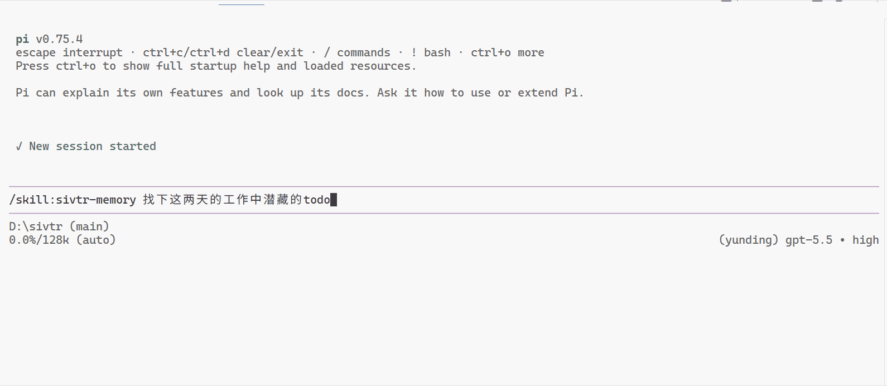
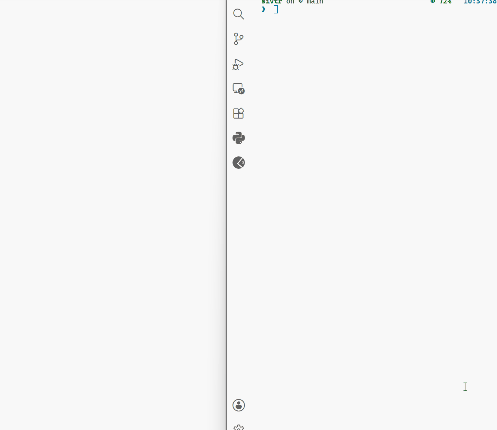
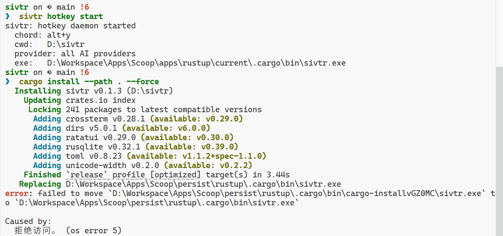
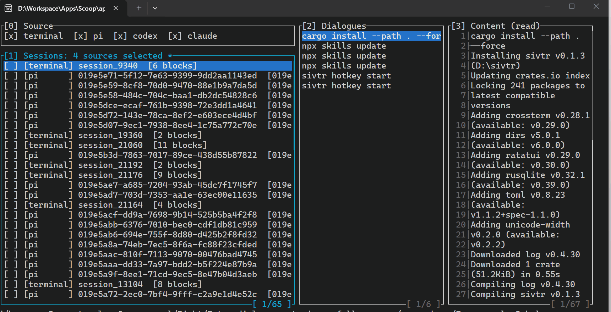
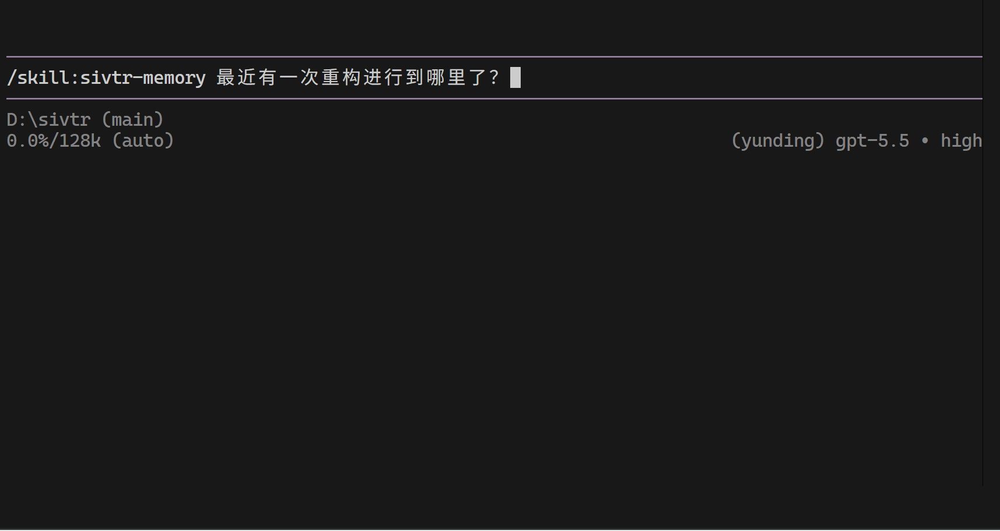

<p align="center">
  
</p>

<h1 align="center">sivtr</h1>

<p align="center">
  面向终端输出和 AI Coding Sessions 的本地工作记忆层。
  <br>
  捕获发生过的事，之后搜索复用，让 Agent 使用精确的本地证据。
  <br>
  <strong>你的 Agent 记忆，不必是一套笨重的知识系统。</strong>
</p>

<p align="center">
  <a href="https://crates.io/crates/sivtr"></a>
  <a href="https://marketplace.visualstudio.com/items?itemName=ariestar.sivtr-vscode"></a>
  <a href="https://github.com/Ariestar/sivtr/actions/workflows/rust.yml"></a>
  <a href="https://deepwiki.com/Ariestar/sivtr"></a>
  <a href="rust-toolchain.toml"></a>
  <a href="https://linux.do/"></a>
</p>

<p align="center">
  <a href="README.md">English</a>
  ·
  <strong>简体中文</strong>
  ·
  <a href="https://sivtr.pages.dev/">Docs</a>
  ·
  <a href="https://sivtr.pages.dev/zh-cn/">中文文档</a>
</p>

<p align="center">
  <a href="https://sivtr.pages.dev/zh-cn/playbooks/">
    
  </a>
  <br>
  <sub>
    把命中结果保存成记忆变量，再继续缩小范围 ·
    <a href="https://sivtr.pages.dev/zh-cn/playbooks/fix-terminal-error/">修复终端报错</a> ·
    <a href="https://sivtr.pages.dev/zh-cn/playbooks/recent-work-timeline/">生成时间线</a> ·
    <a href="https://sivtr.pages.dev/zh-cn/playbooks/agent-handoff/">带证据交接</a>
  </sub>
</p>

---

## 为什么需要 sivtr？

开发者和 Agent 经常浪费时间重建已经存在的上下文：终端报错、测试输出、工具日志、之前的 AI 会话。`sivtr` 把这些本地工作变成可搜索的记忆，但不要求你引入一套很重的知识系统。

有了 `sivtr`，你可以：

- 让 Agent 修复最近一次失败，而不用自己粘贴日志；
- 几秒钟找回昨天的测试输出、构建报错或关键决策；
- 从摘要跳回当时那条命令输出或 Agent 回复；
- 把一组有用结果保存成 `@failures` 这样的变量，在下一条命令里继续用。

> [!IMPORTANT]
> Agent 工作流建议同时安装 `sivtr` CLI 和内置 `sivtr-memory` skill。CLI 负责存取本地记忆；skill 负责教 Agent 何时、如何使用它。

## 特性

- **带输出的 shell history**：记录 Bash、Zsh、PowerShell、Nushell 里的命令、stdout/stderr、退出码、目录和耗时。
- **长输出浏览器**：把 `cargo test`、构建日志、stack trace 管进一个键盘优先的快速 TUI。
- **一个搜索入口找本地工作**：在当前 repo 里同时搜索终端输出和 Codex、Claude Code、Hermes、OpenCode、Pi 会话。
- **能跳回原文的证据**：每个命中都可以展示、复制、展开上下文，或交给 Agent 继续处理。
- **命名记忆变量**：把任意结果保存为 `@failures`，复用 `@last`，用 stdin `@` 接上一条命令，用 `sivtr var list` 查看变量，也能写 `@failures[1,3..5]` 取子集。
- **确定性 anchor 导航**：用 `sivtr nav` 在 parent / child / sibling / session 结构中移动 ref，不做隐式展开。
- **Agent-ready memory**：通过内置 `sivtr-memory` skill 让 Agent 主动检索本地证据。
- **跨设备访问**：把某个 workspace 以只读方式开放出去，用 `desk://...` ref 像读本地一样浏览另一台设备的 session——用于协同开发。
- **诊断工具**：`sivtr doctor`、`sivtr init show`、`sivtr init uninstall`。

## 快速开始

安装预编译 CLI（无需 Rust 工具链）：

```bash
cargo binstall sivtr
```

其它方式：

```bash
brew install ariestar/sivtr/sivtr   # macOS/Linux，通过 Homebrew
cargo install sivtr                  # 从源码编译（需要 Rust）
curl -fsSL https://raw.githubusercontent.com/Ariestar/sivtr/main/install.sh | sh   # Linux/macOS/WSL 一行安装
```

Windows（PowerShell）：

```powershell
irm https://raw.githubusercontent.com/Ariestar/sivtr/main/install.ps1 | iex
```

启用 shell capture：

```bash
sivtr init bash       # 或 zsh、powershell、nushell
sivtr doctor
```

> [!NOTE]
> 在 Windows 上，如果 `sivtr init powershell` 提示 profile 没有加载，执行一次 `Set-ExecutionPolicy -Scope CurrentUser RemoteSigned` 把当前用户的执行策略调高即可。sivtr 不会修改注册表——hook 只写在你的 PowerShell profile 里。

捕获并浏览输出：

```bash
cargo test 2>&1 | sivtr
```

搜索最近 workspace memory：

```bash
sivtr s agent -m "TODO|decision|failed" --since today -f timeline
sivtr s terminal --status failure --latest 1 --refs
```

## Agent memory

全局安装内置 skill：

```bash
npx skills add Ariestar/sivtr --skill sivtr-memory -g
```

然后让 coding agent 先使用本地记忆：

```text
修复最近的终端报错。先用 sivtr。
```

Agent 可以先搜索本地证据、打开命中的原始输出、修改代码并验证结果，而不是先要求你粘贴日志。

## 示例

更多完整玩法见 [Playbooks / 玩法实例](https://sivtr.pages.dev/zh-cn/playbooks/)。

| 场景 | 你怎么用 | 演示 |
| --- | --- | --- |
| 修复最近的终端报错 | 直接对 Agent 说：<br><code>修复最近的终端报错。先用 sivtr。</code> |  |
| 浏览并复制最近终端输出 | <code>cargo test 2&gt;&amp;1 &#124; sivtr</code><br><code>sivtr copy out --print</code> |  |
| 生成最近工作时间线 | <code>sivtr s agent --since today --sort oldest -f timeline</code><br><code>sivtr s terminal --since today --sort oldest -f timeline</code> |  |
| 把结果保存成变量并继续处理 | <code>sivtr s terminal -m "panic" --save failures</code><br><code>sivtr filter @failures --status failure --refs</code><br><code>sivtr var list</code> |  |
| 中断后继续 | 直接对 Agent 说：<br><code>继续。先用 sivtr memory。</code> |  |
| 给下一个 Agent 写交接 | 直接对 Agent 说：<br><code>给下一个 Agent 写一份带证据的交接。</code> |  |

## 核心概念

| 概念 | 含义 |
| --- | --- |
| WorkRecord | 一个有用的工作事件：终端命令、Agent turn、工具调用或捕获输出块。 |
| WorkPart | Record 里的命令、输出、assistant 回复、tool output 或 error。只想拿有用片段而不是整个事件时用它。 |
| WorkRef | 某段精确记忆的稳定地址，例如 `pi/<session>/3/o/1`。适合引用、复现和交接。 |
| WorkSet | `@last`、`@failures` 这类记忆变量背后的数据：一组有顺序的 refs，可以筛选、保存、切片、管道传递、导航、扩展和展示。 |

记忆变量：

| 句柄 | 用途 |
| --- | --- |
| `@last` | 最近一次搜索或投影结果。 |
| `@name` | 通过 `--save name` 或 `sivtr var set name` 创建的命名变量，例如 `@failures`。 |
| `@name[1,3..5]` | 从已保存变量中只取几项。 |
| `@` | 使用管道里上一条命令传来的结果。 |

## 命令概览

| 命令 | 用途 |
| --- | --- |
| `sivtr` / `sivtr pipe` | 读取 stdin 并打开输出浏览器。 |
| `sivtr run <command>` | 执行命令、捕获输出并浏览。 |
| `sivtr copy` | 复制最近终端命令块。 |
| `sivtr copy <provider>` | 从 Codex、Claude Code、Hermes、OpenCode、Pi sessions 复制内容。 |
| `sivtr search` / `sivtr s` | 搜索终端和 Agent memory；命中结果保存为 `@last`。 |
| `sivtr filter <source>` | 对 source 或管道传入的 WorkSet 应用统一过滤。 |
| `sivtr var` | 列出、保存、删除、合并、移除或清空命名 WorkSet 变量。 |
| `sivtr nav <source> <motion>` | 用 `<`、`>N`、`+N`、`-N`、`[A..B]`、`~` 确定性移动 anchors。 |
| `sivtr work sessions` | 列出当前 workspace 的 terminal 和 Agent sessions。 |
| `sivtr work records <source>` | 把 sessions 或已保存变量转成事件级 refs。 |
| `sivtr work parts <source>` | 从匹配事件里抽出真正有用的输入/输出片段。 |
| `sivtr show <ref-or-workset>` | 打印 refs、`@last`、`@name` 或管道结果背后的内容。也支持远程 ref，如 `desk://terminal/...`。 |
| `sivtr zoom <source>` | 给搜索命中补上前后 record 上下文。 |
| `sivtr diff <left> <right>` | 对比最近命令块。 |
| `sivtr serve` | 把某个 workspace 的 session 以只读方式提供给远程设备。 |
| `sivtr remote` | 管理远程设备（`add`/`list`/`remove`/`test`），供 `desk://...` ref 使用。 |
| `sivtr doctor` | 诊断 binary、config、session logs、hooks、providers、clipboard。 |
| `sivtr init <shell>` | 安装 shell integration；也支持 `show` 和 `uninstall`。 |
| `sivtr config` | 管理 TOML 配置文件。 |
| `sivtr history` | 列出、搜索、查看捕获输出历史。 |
| `sivtr hotkey` | 管理 Windows AI session picker 全局热键守护进程。 |

## 远程访问

两台装了 sivtr 的设备可以像读本地一样互相读取 workspace 的 session——用于协同开发：想看队友的终端输出或 AI 会话时，不用离开自己的机器。

在持有 workspace 的那台设备上启动只读 server：

```bash
sivtr serve                   # 默认 iroh——零配置加密跨网；打印连接 ticket
sivtr serve -w <key>          # 指定要开放的 workspace（按 key）
sivtr serve --tcp             # 用明文 HTTP 代替 iroh（localhost；加 --lan 暴露到局域网）
```

在另一台设备上登记它，然后用 `<别名>://` ref（和普通 ref 用法完全一样）：

```bash
sivtr remote add desk <iroh-ticket>       # iroh（默认）——来自 `sivtr serve` 打印的 ticket
sivtr remote add desk 192.168.1.20        # TCP（局域网）；端口默认 7421；token 会提示输入
sivtr show desk://terminal/session_42/3/o/1
```

`sivtr serve` 是 opt-in、只读，并在数据离开本机前脱敏常见密钥（API key、token、PEM 私钥）。默认的 iroh 传输通过 [iroh](https://iroh.computer) 提供加密、穿透 NAT 的连接（中继辅助、无需端口转发、无需账号）；`--tcp` 回退到明文 HTTP，用于 localhost/局域网。未登记的别名会报错——用 `sivtr remote add` 登记。

## 支持来源

| Source | 支持内容 |
| --- | --- |
| Terminal | Bash、Zsh、PowerShell、Nushell shell hooks；pipe 和 run capture。 |
| Codex | 本地 rollout/session JSONL files。 |
| Claude Code | 本地 transcript/session files。 |
| Hermes | 本地 Hermes session JSONL files。 |
| OpenCode | 本地 session data。 |
| Pi | 本地 Pi agent session logs。 |

## 文档

- 文档：[https://sivtr.pages.dev/](https://sivtr.pages.dev/)
- 中文文档：[https://sivtr.pages.dev/zh-cn/](https://sivtr.pages.dev/zh-cn/)
- Playbooks：[https://sivtr.pages.dev/zh-cn/playbooks/](https://sivtr.pages.dev/zh-cn/playbooks/)
- CLI Reference：[docs-site/src/content/docs/reference/cli.md](docs-site/src/content/docs/reference/cli.md)
- Memory skill：[skills/sivtr-memory](skills/sivtr-memory)

## 开发

```bash
cargo fmt --all -- --check
cargo clippy --workspace --all-targets -- -D warnings
cargo test --workspace
```

文档站：

```bash
cd docs-site
bun install --frozen-lockfile
bun run build
```

仓库结构：

```text
crates/sivtr-core/  core model、provider parsers、search、history、config
src/                CLI commands、TUI、shell hooks、hotkey integration
docs-site/          Astro/Starlight documentation site
editors/vscode/     AI session picker 的 VS Code bridge
skills/             bundled agent skills
```
