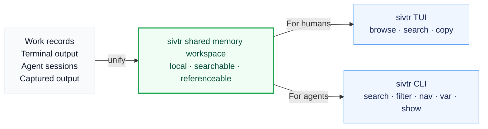

> Unify terminal records and agent conversations into one local, searchable, referenceable shared memory workspace.

Think about `sivtr` in two layers:

1. **Memory layer:** how terminal commands, command output, agent sessions, dialogues, and tool results become shared workspace memory.
2. **Use layer:** how humans browse that memory through the TUI, and how agents retrieve and expand it through CLI commands.



| Layer | Question | Keywords |
| --- | --- | --- |
| Memory layer | Where does memory come from, and how is it organized? | source, session, dialogue, block, ref |
| Use layer | How do humans and agents retrieve that memory? | TUI, search, copy, show, diff, skill, playbook |

## Layer 1: how memory is organized

Shared workspace memory comes from multiple sources, but `sivtr` presents them through a shared structure.

### Source: where memory comes from

A source is where memory originates.

| Source | Content | Examples |
| --- | --- | --- |
| Terminal | Recent commands and output | `bun run build`, `cargo test` |
| Claude | Local Claude Code sessions | user messages, assistant replies, tool results |
| Codex | Local Codex sessions | rollouts / transcripts |
| OpenCode | Local OpenCode sessions | dialogues and tool calls |
| Pi | Local Pi sessions | dialogues, tool calls, execution records |
| Pipe / run | One captured output | `cargo test 2>&1 \| sivtr`, `sivtr run cargo test` |

These sources have different native formats. `sivtr` makes them available through the same workspace TUI and search interface.

### Session: one continuous work record

A session is one continuous record from a source.

- Terminal session: a group of recent command blocks.
- Agent session: one local conversation from an agent provider.
- Pipe / run session: one temporary captured output.

Session is mainly a navigation concept: which terminal run? which agent conversation? which captured output?

### Dialogue / block: the reusable work unit

Different sources have different reusable units:

| Source | Unit |
| --- | --- |
| Terminal | command block: one command + its output |
| Agent | dialogue: a user message, assistant reply, tool call, or tool output |
| Pipe / run | captured block: one captured output |

These units are the usual granularity for copying, searching, and citing evidence. For example:

- copy the latest command output;
- find a prior agent decision;
- expand the full log for a failed build;
- cite a dialogue turn as handoff evidence.

## Layer 2: how memory is used

The same shared workspace memory has two main use paths.

### For humans: workspace TUI

Humans usually start with the unified workspace:

```bash
sivtr
```

The TUI puts terminal and agent sessions together. You can:

- switch between terminal, Claude, Codex, Hermes, OpenCode, and Pi in the Source pane;
- select a work record in the Sessions pane;
- select a command block or dialogue turn in the Dialogues pane;
- inspect exact content in the Content pane;
- search the workspace with `/`;
- copy input, output, blocks, or commands with `i` / `o` / `y` / `c`.

This is the human-facing path: browse, search, select, copy.

### For agents: CLI retrieval

Agents usually should not open an interactive TUI. They retrieve the same memory with non-interactive commands:

```bash
sivtr search terminal --match "error|failed|panic" --format json --limit 20
sivtr copy out 1 --print
sivtr show terminal/current/2 --json
```

This is the agent-facing path: search, filter or navigate anchors, expand exact content, then act using current files and validation results.

## Two addressing methods: Selector and Ref

Selector and Ref are use-layer addressing tools for shared workspace memory.

### Selector: locate by recency

Selectors are used by commands such as `copy` and `diff`. They are best for recent context.

| Selector | Meaning |
| --- | --- |
| omitted | latest item, same as `1` |
| `1` | latest item |
| `2` | previous item |
| `2..4` | recent range |

Examples:

```bash
sivtr copy out 1 --print
sivtr copy cmd 1..10 --print
sivtr diff 1 2
```

### Ref: return to exact evidence

Refs are used by `show`. They point to exact workspace locations from search results.

```text
[origin:]source/session[/dialogue[/block]]
```

Examples:

```bash
sivtr show terminal/current/2
sivtr show claude/<session-id>/3
sivtr show claude/<session-id>/3/2
sivtr show desk:terminal/session_42/3
sivtr show docs:codex/4
```

`search --format refs` / `--format workset` returns refs, so humans and agents can search first and then expand the same evidence. Origins come from mounted remote aliases (`sivtr remote add`) or local workspace names (`sivtr ws list`).

## WorkSet: pipeable memory selections

A WorkSet is an ordered set of active anchors plus the materialized records needed to render them. It is what powers `@last`, named variables, and `@` pipelines.

| Handle | Meaning |
| --- | --- |
| `@last` | Most recent WorkSet produced by a WorkSet command. |
| `@name` | Named WorkSet saved by `--save name` or `sivtr var set name`. |
| `@name[1,3..5]` | 1-based slice of a saved WorkSet. |
| `@` | WorkSet JSON from stdin. |

The core pipeline is small:

```text
search = find evidence
filter = narrow a WorkSet
nav    = move anchors deterministically
var    = remember named WorkSets
show   = render exact content
```

`nav` uses deterministic motion and does not default-expand children:

```bash
sivtr nav @hit '<' --refs          # parent
sivtr nav @hit '>1' --refs         # first child
sivtr nav @hit '<+1>1' --refs      # next record, first child
sivtr nav @hit '<[-2..+2]' --refs  # sibling window around parent record
sivtr nav @hit '~' --refs          # containing session records
```

## Commands

Shared workspace memory can be opened, searched, copied, expanded, compared, or temporarily captured with these commands:

| Command | Purpose |
| --- | --- |
| `sivtr` | Open the unified workspace TUI |
| `sivtr copy` | Copy recent terminal blocks by selector |
| `sivtr copy <provider>` | Read content from one agent provider |
| `sivtr search` | Search shared workspace memory across terminal and agent sessions |
| `sivtr filter` | Narrow a WorkSet using the shared filter surface |
| `sivtr var` | Save, list, merge, drop, or remove named WorkSet variables |
| `sivtr nav` | Move anchors with deterministic parent/child/sibling/session motion |
| `sivtr show` | Expand exact content by ref or WorkSet |
| `sivtr share` / `remote` | Opt-in read-only cross-device memory mounts |
| `sivtr diff` | Compare two recent terminal command blocks |
| `sivtr run` / pipe | Temporarily capture and browse one command output |

## Where skills and playbooks fit

Skills and playbooks are use-layer procedures. They tell agents how to retrieve, expand, and verify shared workspace memory for a scenario.

For example, "fix the latest terminal error" can use this retrieval pattern:

```bash
sivtr search terminal --match "error|failed|panic|Traceback|Exception|exit code|FAILED" --format json --limit 20
sivtr copy out 1 --print
sivtr copy cmd 1..10 --print
```

Then the agent continues with code inspection and verification.

## Local-first

By default, `sivtr` reads terminal records and agent sessions on your machine. Local data, one interface, and traceable references make it work well as a shared memory workspace. Cross-device access is opt-in through [Remote Access](/usage/remote-access/); the scenario playbook is [Remote collaboration memory](/playbooks/remote-collaboration-memory/).
